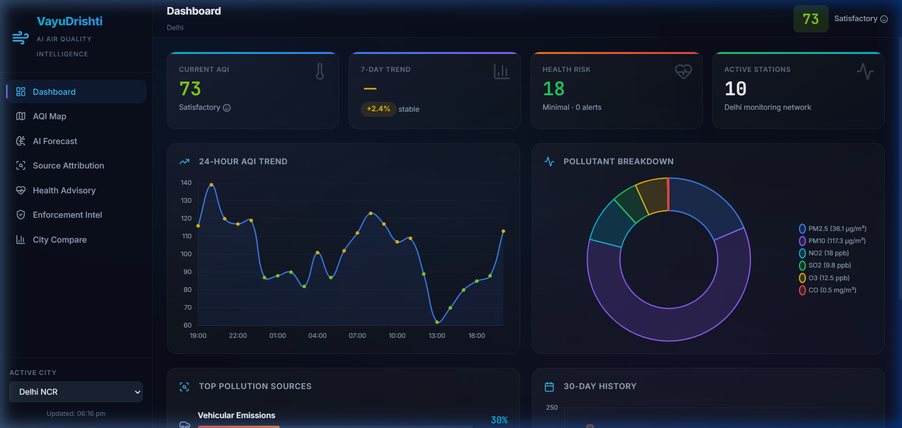
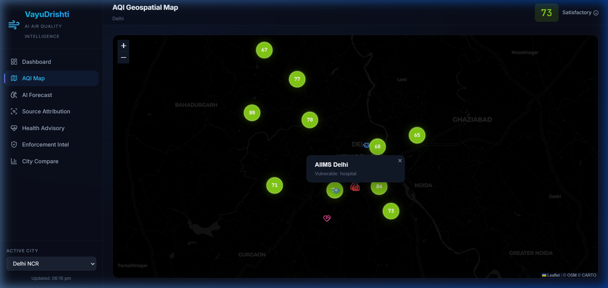
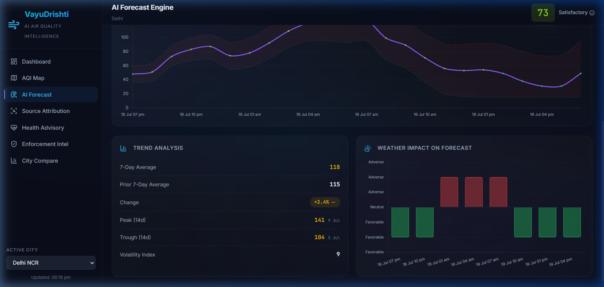
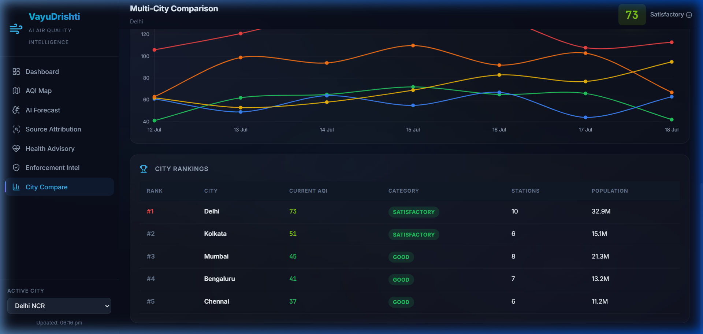
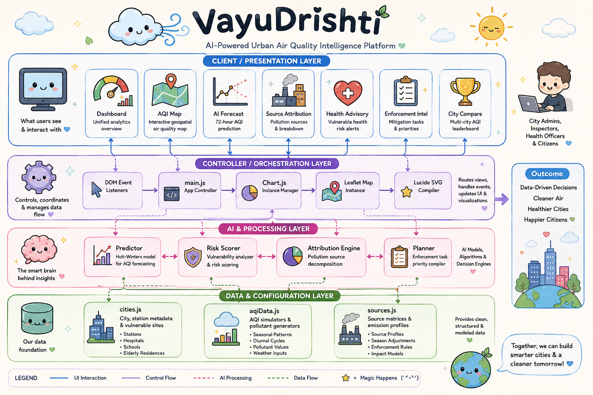

# VayuDrishti 🌬️
### AI-Powered Urban Air Quality Intelligence Platform

Developed for the **ET AI Hackathon 2026** under **Theme 5: Smart Cities / Environmental Intelligence / Geospatial Analytics / Public Health**.

VayuDrishti is a premium, real-time, glassmorphic dark-mode dashboard designed for city administrators, municipal inspectors, health officers, and citizens. It moves smart cities from reactive pollution monitoring to proactive, evidence-backed environmental interventions.

---

## 🏃 Quick Start / How to Test This Project (Portable Options)

Since this project has been built using a portable assets configuration (`base: './'`), anyone can test and run it instantly. Choose any of the following options:

### ⚡ Option A: Zero-Install Quick Launch (Recommended)
If you just want to run the pre-compiled, optimized production version without installing any dependencies:
1. Open your terminal inside the project root directory.
2. **If you have Python installed**, run:
   ```bash
   python -m http.server 8000 --directory dist
   ```
   *Then open your browser and navigate to `http://localhost:8000/`.*
3. **If you have Node.js installed**, run:
   ```bash
   npx serve dist
   ```
   *Then open the localhost port shown in your terminal.*

---

### 🛠️ Option B: Developer Mode (Live Reloading)
If you want to run the developer server and inspect/modify the source code:
1. Open your terminal inside the project root directory.
2. Install npm dependencies:
   ```bash
   npm install
   ```
3. Launch the development server:
   ```bash
   npm run dev
   ```
   *Then open `http://localhost:5173/` in your browser.*

---

## 📸 Screenshots

### 1. Unified Analytics Dashboard
An executive summary of current air quality metrics, 7-day predictive trend lines, health warnings, active monitoring networks, pollutant breakdowns, top source attributions, and historical charts.



### 2. Interactive Geospatial AQI Map
Interactive high-performance map featuring 37 active monitoring stations color-coded by AQI levels, surrounding heat circles, and geospatial markers representing vulnerable populations (hospitals 🏥, schools 🏫, elderly residences 👵).



### 3. Hyperlocal AI Forecast Engine
72-hour AQI prediction showing confidence bands (upper and lower bounds), 14-day trend volatility metrics, and detailed meteorological influence indexes.



### 4. Multi-City Comparison Leaderboard
Side-by-side air quality indexing across 5 metropolitan regions (Delhi NCR, Mumbai, Bengaluru, Kolkata, Chennai) with comparative charting and leaderboard listings.




---

## 🚀 Key Features

1. **Interactive Geospatial Map (Leaflet.js)**
   - Dark Carto tile layer optimized for low-light command centers.
   - Customized DivIcons representing real-time AQI values with pulsing color gradients.
   - Dynamic popup binding displaying full pollutant parameters (PM2.5, PM10, NO2, SO2, O3, CO) upon interaction.
   - Vulnerability pinpoints marking critical facilities inside high-pollution zones.

2. **AI-Powered 72-Hour Forecasting**
   - Triple exponential smoothing with trend/seasonality decomposition.
   - Diurnal cycle modeling correlating morning traffic rush hours and evening thermal inversions.
   - Dynamic meteorological factor weighting (wind dispersion speed, humidity variables).
   - Generates confidence intervals that widen over the forecast window.

3. **Geospatial Pollution Source Attribution**
   - Statistical decomposition of major emission contributors (Vehicular, Industrial, Construction Dust, Agricultural Burning, Domestic, Road Sweeping, Power Plants).
   - Season-adjusted profiles reflecting realistic Indian urban patterns (e.g., stubble burning in Delhi winter, high moisture dispersion in Mumbai monsoon).
   - Displays percentage breakdowns and algorithm confidence indicators.

4. **Vulnerable Health Risk Advisories**
   - Risk scoring algorithm (0-100) mapping target zones against exposed group coefficients.
   - Contextual actions: PE suspension notices for schools, air recirculation commands for ICU wings, shift rotation mandates for outdoor workers.

5. **Enforcement Intelligence & Prioritization**
   - Live recommendation registry ranking mitigation tasks.
   - Auto-generated tasks with target zones, expected impact timelines, priority levels, and urgency levels linked to current AQI thresholds.

---

## 🛠️ Architecture



---
## 📁 Project Structure

```
ai-project/
├── index.html                    # Main HTML5 Document Shell
├── vite.config.js                # Vite build configuration (base: './' for portability)
├── package.json                  # Project Node Manifest (Vite, Leaflet, Chart.js, Lucide)
├── README.md                     # Submission documentation
├── screenshots/                  # High-resolution screenshots of all views
│   ├── dashboard.png
│   ├── aqi_map.png
│   ├── ai_forecast.png
│   ├── city_compare.png
│   └── architecture_diagram.png
├── dist/                         # PRE-COMPILED PORTABLE ASSETS
│   ├── index.html                # Compiled html index
│   └── assets/                   # Compiled CSS/JS assets (relatives paths configured)
├── src/
│   ├── main.js                   # Application Controller, view routers & chart handlers
│   ├── style.css                 # Glassmorphic dark design system
│   ├── data/
│   │   ├── cities.js             # Station configurations & vulnerable site indices
│   │   ├── aqiData.js            # AQI model data generators & pollutant values
│   │   └── sources.js            # Source attribution & enforcement models
│   └── ai/
│       ├── predictor.js          # Forecasting, trend parsing, & weather simulation
│       └── healthRisk.js         # Advisory algorithms & group risk weighting
```
